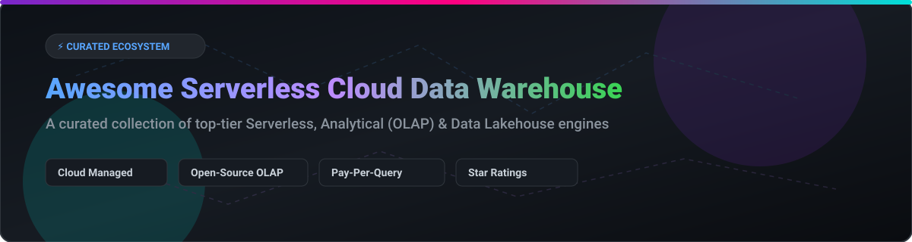

# Awesome Serverless Cloud Data Warehouse 🚀 

  
  
  
  

## 📌 Top Serverless Cloud Data Warehouse Ecosystem

**A curated list of SaaS products & open-source GitHub projects focused on elastic analytics, managed data warehouses, and self-hosted OLAP engines.**  

> **Market Insights:** The global cloud data warehouse & analytical database market size is estimated at **~$35B+ (2026)** and projected to exceed **$70B+ by 2030**. The sector is **moderately fragmented**: dominated by hyperscalers and key leaders (Snowflake, Databricks, AWS, Google Cloud) while featuring high innovation and strong growth from specialized open-source and real-time engines (ClickHouse, DuckDB, StarRocks, Neon).

---

## 💡 Key Highlights & Features

- **Elastic Auto-Scaling:** Pay only for compute used during query execution ⚡
- **Decoupled Architecture:** Independent scaling of compute clusters and object storage 🏗️
- **Zero Infrastructure Overhead:** Fully managed operations, zero provisioning ☁️
- **Open Lakehouse Formats:** Native support for Apache Iceberg, Delta Lake, and Apache Hudi 📊

---

## 📑 Table of Contents

- [☁️ SaaS & Hosted Platforms](#️-saas--hosted-platforms)
- [🔥 Open-Source GitHub Projects](#-open-source-github-projects)
  - [⚡ Real-Time Analytical Databases](#-real-time-analytical-databases)
  - [📦 In-Process & Embedded Analytics](#-in-process--embedded-analytics)
  - [🏛️ MPP & Traditional Warehouses](#️-mpp--traditional-warehouses)
  - [🧊 Lakehouse & Table Formats](#-lakehouse--table-formats)
  - [🛠️ Frameworks & Ecosystem Utilities](#️-frameworks--ecosystem-utilities)
- [🌟 Star History](#-star-history)
- [💖 Support & Contributing](#-support--contributing)
- [⚠️ Disclaimer](#️-disclaimer)

---

## ☁️ SaaS & Hosted Platforms

| Product 🏢 | Market Size / Valuation / Revenue 💰 | Starting Tier Pricing 💳 | Free Tier / Trial Limits 🎁 | Best For 🎯 |
| :--- | :--- | :--- | :--- | :--- |
| **[Databricks Serverless SQL](https://www.databricks.com/)** | **~$190B Valuation** (~$7B Revenue run-rate) | ~$0.70 / DBU (Serverless SQL compute) | 14-Day Free Trial (Full platform access + cloud credits) | Lakehouse analytics |
| **[Snowflake](https://www.snowflake.com/)** | **~$120B Market Cap** (~$5.4B Revenue) | ~$2.00 / Snowflake Credit (Standard Edition) | $400 Free Credits (valid for 30 days) | Enterprise analytics |
| **[Amazon Redshift Serverless](https://aws.amazon.com/redshift/redshift-serverless/)** | **Multi-Billion Sector Leader** (AWS Core) | ~$0.375 / RPU-hour | $300 Free Trial Credit (valid for 90 days) | AWS-native analytics |
| **[Google Cloud BigQuery](https://cloud.google.com/bigquery)** | **Multi-Billion Sector Leader** (GCP Core) | ~$6.25 / TB scanned (On-Demand) | 10 GB storage + 1 TB queries free per month forever | GCP-native analytics |
| **[Starburst Galaxy](https://www.starburst.io/)** | **~$1.5B Valuation** | ~$0.55 / Starburst Credit | $500 Free Trial Credits | Data mesh and federation |
| **[ClickHouse Cloud](https://clickhouse.com/)** | **Venture Backed ($50M+ Series B)** | ~$0.16 / compute unit hour | $300 Free Trial Credit (valid for 30 days) | Real-time analytics |
| **[Neon Serverless Postgres](https://neon.tech/)** | **Venture Backed Scale-up** | ~$0.10 / CU hour (Paid Tier starts at $19/mo) | 0.5 GiB storage + 100 hrs compute free per month forever | Serverless Postgres |
| **[MotherDuck](https://motherduck.com/)** | **Venture Backed Scale-up (a16z)** | ~$0.10 / Duck Capacity Unit (DCU) min | 10 GB storage + 10 DCU-hours free per month forever | DuckDB users |
| **[Firebolt](https://www.firebolt.io/)** | **Venture Backed Scale-up** | ~$0.485 / FBU-hour | $200 Free Trial Credit (valid for 30 days) | Interactive analytics |
| **[Hydrolix](https://hydrolix.io/)** | **Venture Backed Scale-up** | ~$0.45 / ingest GB | 14-Day Free Trial (Full feature access) | Long-term log analytics |

---

## 🔥 Open-Source GitHub Projects

### ⚡ Real-Time Analytical Databases

-  **[ClickHouse](https://github.com/ClickHouse/ClickHouse)**  
  **The leading columnar analytical database** (Apache-2.0). High-performance real-time ingestion and sub-second SQL queries over massive datasets. ⚡ **Best for real-time analytics & observability.**

-  **[Apache Doris](https://github.com/apache/doris)**  
  **Real-time analytical database** (Apache-2.0). High-performance MPP analytical database for real-time reporting and unified data warehousing. 🚀 **Best for real-time SQL analytics.**

-  **[Apache Druid](https://github.com/apache/druid)**  
  **Real-time analytics database** (Apache-2.0). Designed for fast random read/write queries on streaming data feeds. 📈 **Best for streaming OLAP.**

-  **[StarRocks](https://github.com/StarRocks/starrocks)**  
  **Next-gen sub-second MPP database** (Apache-2.0). Vectorized query execution engine designed for multi-table join analytics. ✨ **Best for modern real-time lakehouses.**

-  **[Apache Pinot](https://github.com/apache/pinot)**  
  **Distributed OLAP datastore** (Apache-2.0). Engineered for low-latency analytical queries at ultra-high concurrency. 📊 **Best for user-facing analytics.**

---

### 📦 In-Process & Embedded Analytics

-  **[Polars](https://github.com/pola-rs/polars)**  
  **Blazing-fast DataFrame library in Rust** (MIT). Multi-threaded vectorized query processing for local and distributed workloads. 🐻 **Best for data manipulation.**

-  **[DuckDB](https://github.com/duckdb/duckdb)**  
  **In-process analytical database** (MIT). *"SQLite for Analytics"* featuring zero-dependency embedded execution. 🦆 **Best for embedded analytics.**

-  **[Apache DataFusion](https://github.com/apache/datafusion)**  
  **Extensible query engine in Rust** (Apache-2.0). Arrow-native SQL engine designed for building custom data systems. ⚙️ **Best for building query engines.**

-  **[chDB](https://github.com/chdb-io/chdb)**  
  **In-process SQL OLAP engine powered by ClickHouse** (Apache-2.0). Run ClickHouse directly inside Python, C++, Go, and Rust processes. ⚡ **Best for Python in-memory OLAP.**

---

### 🏛️ MPP & Traditional Warehouses

-  **[Apache Hive](https://github.com/apache/hive)**  
  **Distributed data warehouse for Hadoop** (Apache-2.0). Facilitates reading, writing, and managing large datasets residing in distributed storage. 🐘 **Best for Hadoop ecosystems.**

-  **[Greenplum](https://github.com/greenplum-db/gpdb)**  
  **MPP data warehouse based on PostgreSQL** (Apache-2.0). Petabyte-scale analytic engine built for complex SQL analytics. 🐘 **Best for on-premises data warehousing.**

-  **[Apache Impala](https://github.com/apache/impala)**  
  **MPP SQL query engine for Apache Hadoop** (Apache-2.0). Low-latency, high-concurrency SQL analytics directly on HDFS. ⚡ **Best for Hadoop-native analytics.**

-  **[Apache Kylin](https://github.com/apache/kylin)**  
  **Distributed analytical engine** (Apache-2.0). Designed to provide SQL interface and multi-dimensional analysis (OLAP) on Hadoop. 💎 **Best for big data OLAP.**

---

### 🧊 Lakehouse & Table Formats

-  **[Trino](https://github.com/trinodb/trino)**  
  **Fast distributed SQL query engine** (Apache-2.0). Federated query engine capable of querying across 50+ heterogeneous data sources. 🔌 **Best for federated analytics.**

-  **[Apache Iceberg](https://github.com/apache/iceberg)**  
  **High-performance table format for analytic datasets** (Apache-2.0). Enables ACID transactions, time-travel, and schema evolution. 🧊 **Best for lakehouse architectures.**

-  **[Delta Lake](https://github.com/delta-io/delta)**  
  **Open table format with ACID transactions** (Apache-2.0). Brings reliability, schema enforcement, and transaction logs to cloud storage. 🔺 **Best for Spark & Databricks.**

-  **[Apache Hudi](https://github.com/apache/hudi)**  
  **Transactional data lake platform** (Apache-2.0). Supports streaming ingestion, incremental processing, and efficient upserts/deletes. 🔥 **Best for streaming data lakes.**

---

### 🛠️ Frameworks & Ecosystem Utilities

-  **[Apache Arrow](https://github.com/apache/arrow)** — Cross-language development platform for in-memory data 🏹
-  **[Apache Superset](https://github.com/apache/superset)** — Modern enterprise-ready data exploration and visualization platform 📈
-  **[Metabase](https://github.com/metabase/metabase)** — Easy, open-source business intelligence and analytics platform 📊
-  **[Apache Calcite](https://github.com/apache/calcite)** — Dynamic data management and query optimization framework ⚙️
-  **[Substrait](https://github.com/substrait-io/substrait)** — Cross-platform relational algebra plan format 🌐

---

## 🌟 Star History

---

## 💖 Support & Contributing

Contributions are warmly welcome! Whether you are adding a new serverless platform, open-source OLAP tool, or improving descriptions, please feel free to open a Pull Request.

- ⭐ **Star this repository** if you find it valuable!
- 🔀 **Fork & Share** it with your team and fellow data engineers.
- 💬 Join the conversation on [Discord](https://discord.gg/jc4xtF58Ve).
- ☕ **Support the maintainer:** Feel free to [Sponsor on GitHub](https://github.com/sponsors/ishandutta2007) to help keep this repository up-to-date and maintain quality resources.

---

## ⚠️ Disclaimer

- This is a **community-curated** list — not exhaustive and not an official endorsement.
- Data warehouses process sensitive enterprise data. Self-hosted solutions require security hardening, access controls, and compliance monitoring.
- **License considerations**: ClickHouse (Apache-2.0), DuckDB (MIT), Doris (Apache-2.0), and StarRocks (Apache-2.0) are permissive for commercial use. Always verify licensing against your organizational policies.
